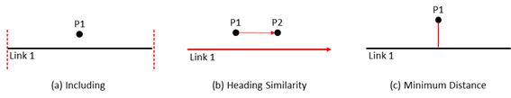
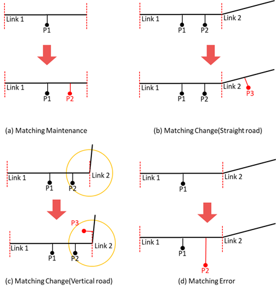
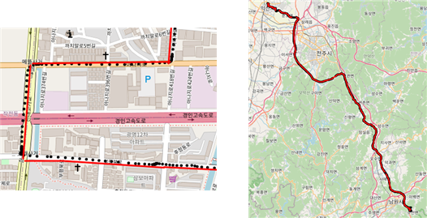

# traj2seg-v2
이 repo는 https://github.com/jsm9720/traj2seg 의 매칭 오류들을 개선 하였다.  
매칭 변경을 판단할 때 including, heading과 distance만 비교하면 궤적 포인트의  주기가 큰 궤적일 경우 서로 연결된 링크사이에 링크 변경시 매칭 오류가 발생한다. 이를 해결하기 위해 매칭 변경시에 링크 끝지점과의 계산을 수행하는 과정을 추가하였다.  

## Dependencies
python 3.x  
haversine 2.3.0  

## Data
- incheon.geojson : 인천지역 링크 데이터
- traj/ : 인천지역 궤적 데이터

## How to use
궤적링크매칭은 `main.py`를 수행하면 된다.  
세부적으로 `read_segment.py`에서 링크 데이터를 읽어오며 `read_traj.py`에서 궤적 데이터를 읽어온다.  
이렇게 읽어온 데이터들을 `mapping.py`에 입력으러 주어 실행시키면 각 링크ID에 궤적 index가 매핑된다.

## Mapping Result

매핑 정확도  
- GT(Ground Truth) : 149 link
- TP(잘 매칭된 경우) : 135 link
- FP(매칭되면 안되는데 매칭된 경우) : 2 link
  
[traj2seg](https://github.com/jsm9720/traj2seg) 보다 더 좋은 성능 확인할 수 있다.
